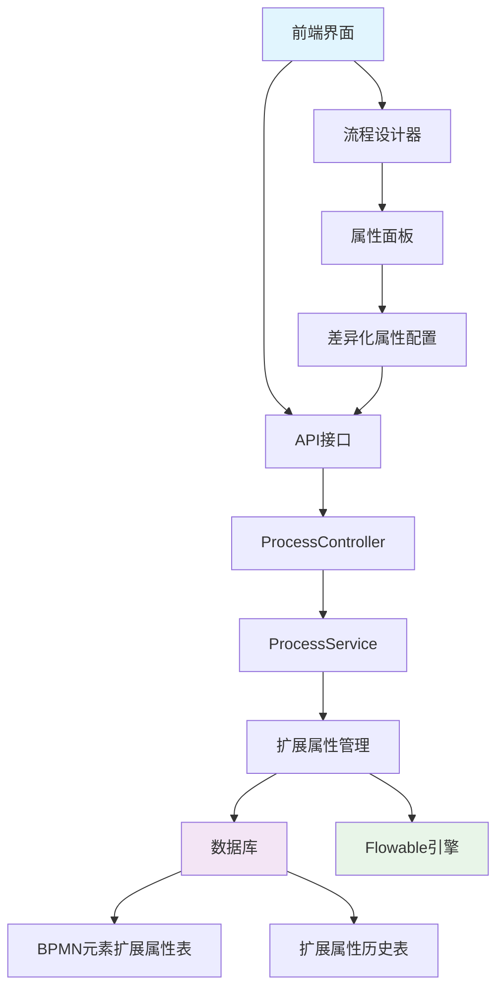

# BPMN元素扩展属性管理系统设计方案

## 1. 需求分析

### 1.1 当前系统存在的问题
当前的流程模板设计存在以下缺陷：
- 对BPMN不同元素使用了统一的属性配置，缺乏针对性
- 用户任务节点无法配置执行人，服务任务节点无法配置接口URL，网关无法配置路由条件
- 缺乏对BPMN标准元素的差异化属性管理
- 扩展属性未使用JSON格式存储，无法灵活扩展

### 1.2 需求概述
根据BPMN 2.0行业标准，需要为不同的BPMN元素提供差异化属性配置：
- 用户任务节点：支持配置执行人、候选用户、候选组、表单Key等
- 服务任务节点：支持配置实现类、表达式、代理表达式、结果变量等
- 网关节点：支持配置路由条件、默认路径等
- 事件节点：支持配置消息类型、定时器配置等

### 1.3 目标
- 实现BPMN元素的差异化属性管理
- 使用JSON格式存储扩展属性
- 提供对应的Java类管理
- 设计专门的数据库表记录扩展属性

## 2. 详细设计方案

### 2.1 BPMN元素分类与属性定义

#### 2.1.1 用户任务(UserTask)属性
- assignee: 执行人
- candidateUsers: 候选用户
- candidateGroups: 候选组
- formKey: 表单Key
- dueDate: 截止日期
- priority: 优先级
- category: 分类

#### 2.1.2 服务任务(ServiceTask)属性
- implementation: 实现类
- expression: 表达式
- delegateExpression: 代理表达式
- resultVariableName: 结果变量名
- type: 任务类型
- async: 是否异步执行

#### 2.1.3 网关(Gateway)属性
- default: 默认路径
- conditionExpression: 条件表达式
- gatewayType: 网关类型(Exclusive/Inclusive/Parallel)

#### 2.1.4 事件(Event)属性
- messageRef: 消息引用
- timerEventDefinition: 定时器配置
- signalRef: 信号引用
- escalationRef: 升级引用

### 2.2 数据库设计

#### 2.2.1 扩展属性表
```sql
-- BPMN元素扩展属性表
CREATE TABLE bpmn_element_extension (
    id BIGINT PRIMARY KEY AUTO_INCREMENT,
    process_definition_id VARCHAR(255) NOT NULL COMMENT '流程定义ID',
    element_id VARCHAR(255) NOT NULL COMMENT 'BPMN元素ID',
    element_type VARCHAR(100) NOT NULL COMMENT 'BPMN元素类型',
    extension_attributes JSON COMMENT '扩展属性JSON',
    version INT DEFAULT 1 COMMENT '版本号',
    created_time TIMESTAMP DEFAULT CURRENT_TIMESTAMP COMMENT '创建时间',
    updated_time TIMESTAMP DEFAULT CURRENT_TIMESTAMP ON UPDATE CURRENT_TIMESTAMP COMMENT '更新时间',
    INDEX idx_process_element (process_definition_id, element_id),
    INDEX idx_element_type (element_type)
);
```

#### 2.2.2 扩展属性历史表
```sql
-- BPMN元素扩展属性历史表
CREATE TABLE bpmn_element_extension_history (
    id BIGINT PRIMARY KEY AUTO_INCREMENT,
    extension_id BIGINT NOT NULL COMMENT '扩展属性ID',
    process_definition_id VARCHAR(255) NOT NULL COMMENT '流程定义ID',
    element_id VARCHAR(255) NOT NULL COMMENT 'BPMN元素ID',
    element_type VARCHAR(100) NOT NULL COMMENT 'BPMN元素类型',
    extension_attributes JSON COMMENT '扩展属性JSON',
    version INT NOT NULL COMMENT '版本号',
    operation_type VARCHAR(50) NOT NULL COMMENT '操作类型',
    operation_time TIMESTAMP DEFAULT CURRENT_TIMESTAMP COMMENT '操作时间',
    INDEX idx_extension_id (extension_id),
    INDEX idx_process_element (process_definition_id, element_id)
);
```

### 2.3 后端实现

#### 2.3.1 创建实体类

创建 `BpmnElementExtension.java` 实体类：

```java
package com.lingflow.entity;

import com.fasterxml.jackson.databind.JsonNode;
import lombok.Data;

import java.time.LocalDateTime;

@Data
public class BpmnElementExtension {
    private Long id;
    private String processDefinitionId;
    private String elementId;
    private String elementType;
    private JsonNode extensionAttributes; // JSON格式存储扩展属性
    private Integer version;
    private LocalDateTime createdTime;
    private LocalDateTime updatedTime;
}
```

创建 `BpmnElementExtensionHistory.java` 历史实体类：

```java
package com.lingflow.entity;

import com.fasterxml.jackson.databind.JsonNode;
import lombok.Data;

import java.time.LocalDateTime;

@Data
public class BpmnElementExtensionHistory {
    private Long id;
    private Long extensionId;
    private String processDefinitionId;
    private String elementId;
    private String elementType;
    private JsonNode extensionAttributes;
    private Integer version;
    private String operationType; // CREATE, UPDATE, DELETE
    private LocalDateTime operationTime;
}
```

#### 2.3.2 扩展属性枚举定义

创建 `BpmnElementType.java` 枚举类：

```java
package com.lingflow.enums;

public enum BpmnElementType {
    USER_TASK("userTask"),
    SERVICE_TASK("serviceTask"),
    SCRIPT_TASK("scriptTask"),
    BUSINESS_RULE_TASK("businessRuleTask"),
    RECEIVE_TASK("receiveTask"),
    MANUAL_TASK("manualTask"),
    EXCLUSIVE_GATEWAY("exclusiveGateway"),
    INCLUSIVE_GATEWAY("inclusiveGateway"),
    PARALLEL_GATEWAY("parallelGateway"),
    EVENT_GATEWAY("eventGateway"),
    START_EVENT("startEvent"),
    END_EVENT("endEvent"),
    INTERMEDIATE_CATCH_EVENT("intermediateCatchEvent"),
    INTERMEDIATE_THROW_EVENT("intermediateThrowEvent"),
    BOUNDARY_EVENT("boundaryEvent"),
    SUB_PROCESS("subProcess"),
    CALL_ACTIVITY("callActivity"),
    SEQUENCE_FLOW("sequenceFlow");

    private final String value;

    BpmnElementType(String value) {
        this.value = value;
    }

    public String getValue() {
        return value;
    }
}
```

#### 2.3.3 扩展属性数据传输对象

创建 `BpmnElementExtensionDTO.java`：

```java
package com.lingflow.dto;

import com.fasterxml.jackson.databind.JsonNode;
import lombok.Data;

@Data
public class BpmnElementExtensionDTO {
    private Long id;
    private String processDefinitionId;
    private String elementId;
    private String elementType;
    private JsonNode extensionAttributes;
    private Integer version;
}
```

#### 2.3.4 扩展属性查询结果对象

创建 `ElementExtensionQueryResult.java`：

```java
package com.lingflow.dto;

import com.fasterxml.jackson.databind.JsonNode;
import lombok.Data;

@Data
public class ElementExtensionQueryResult {
    private String elementId;
    private String elementType;
    private JsonNode extensionAttributes;
    private Integer version;
    private boolean exists;
}
```

#### 2.3.5 数据访问层接口

创建 `BpmnElementExtensionRepository.java`：

```java
package com.lingflow.repository;

import com.lingflow.entity.BpmnElementExtension;
import com.lingflow.entity.BpmnElementExtensionHistory;
import org.apache.ibatis.annotations.Param;

import java.util.List;

public interface BpmnElementExtensionRepository {
    
    /**
     * 保存BPMN元素扩展属性
     */
    void save(BpmnElementExtension extension);
    
    /**
     * 更新BPMN元素扩展属性
     */
    void update(BpmnElementExtension extension);
    
    /**
     * 根据流程定义ID和元素ID查找扩展属性
     */
    BpmnElementExtension findByProcessAndElement(@Param("processDefinitionId") String processDefinitionId, 
                                               @Param("elementId") String elementId);
    
    /**
     * 根据流程定义ID查找所有扩展属性
     */
    List<BpmnElementExtension> findByProcessDefinitionId(@Param("processDefinitionId") String processDefinitionId);
    
    /**
     * 根据元素类型查找扩展属性
     */
    List<BpmnElementExtension> findByElementType(@Param("elementType") String elementType);
    
    /**
     * 删除BPMN元素扩展属性
     */
    void deleteByProcessAndElement(@Param("processDefinitionId") String processDefinitionId, 
                                 @Param("elementId") String elementId);
    
    /**
     * 保存扩展属性历史记录
     */
    void saveHistory(BpmnElementExtensionHistory history);
    
    /**
     * 根据扩展ID查找历史记录
     */
    List<BpmnElementExtensionHistory> findHistoryByExtensionId(@Param("extensionId") Long extensionId);
}
```

#### 2.3.6 扩展属性Mapper XML

创建 `BpmnElementExtensionRepository.xml`：

```xml
<?xml version="1.0" encoding="UTF-8"?>
<!DOCTYPE mapper PUBLIC "-//mybatis.org//DTD Mapper 3.0//EN" 
    "http://mybatis.org/dtd/mybatis-3-mapper.dtd">

<mapper namespace="com.lingflow.repository.BpmnElementExtensionRepository">
    <resultMap id="BpmnElementExtensionResultMap" type="com.lingflow.entity.BpmnElementExtension">
        <id property="id" column="id"/>
        <result property="processDefinitionId" column="process_definition_id"/>
        <result property="elementId" column="element_id"/>
        <result property="elementType" column="element_type"/>
        <result property="extensionAttributes" column="extension_attributes" javaType="com.fasterxml.jackson.databind.JsonNode" 
                typeHandler="org.apache.ibatis.type.JsonTypeHandler"/>
        <result property="version" column="version"/>
        <result property="createdTime" column="created_time"/>
        <result property="updatedTime" column="updated_time"/>
    </resultMap>
    
    <resultMap id="BpmnElementExtensionHistoryResultMap" type="com.lingflow.entity.BpmnElementExtensionHistory">
        <id property="id" column="id"/>
        <result property="extensionId" column="extension_id"/>
        <result property="processDefinitionId" column="process_definition_id"/>
        <result property="elementId" column="element_id"/>
        <result property="elementType" column="element_type"/>
        <result property="extensionAttributes" column="extension_attributes" javaType="com.fasterxml.jackson.databind.JsonNode" 
                typeHandler="org.apache.ibatis.type.JsonTypeHandler"/>
        <result property="version" column="version"/>
        <result property="operationType" column="operation_type"/>
        <result property="operationTime" column="operation_time"/>
    </resultMap>

    <insert id="save" parameterType="com.lingflow.entity.BpmnElementExtension">
        INSERT INTO bpmn_element_extension 
        (process_definition_id, element_id, element_type, extension_attributes, version, created_time, updated_time)
        VALUES 
        (#{processDefinitionId}, #{elementId}, #{elementType}, #{extensionAttributes}, #{version}, NOW(), NOW())
    </insert>

    <update id="update" parameterType="com.lingflow.entity.BpmnElementExtension">
        UPDATE bpmn_element_extension 
        SET extension_attributes = #{extensionAttributes}, 
            version = version + 1,
            updated_time = NOW()
        WHERE process_definition_id = #{processDefinitionId} AND element_id = #{elementId}
    </update>

    <select id="findByProcessAndElement" parameterType="map" resultMap="BpmnElementExtensionResultMap">
        SELECT * FROM bpmn_element_extension 
        WHERE process_definition_id = #{processDefinitionId} AND element_id = #{elementId}
    </select>

    <select id="findByProcessDefinitionId" parameterType="string" resultMap="BpmnElementExtensionResultMap">
        SELECT * FROM bpmn_element_extension 
        WHERE process_definition_id = #{processDefinitionId}
        ORDER BY element_id
    </select>

    <select id="findByElementType" parameterType="string" resultMap="BpmnElementExtensionResultMap">
        SELECT * FROM bpmn_element_extension 
        WHERE element_type = #{elementType}
        ORDER BY process_definition_id, element_id
    </select>

    <delete id="deleteByProcessAndElement" parameterType="map">
        DELETE FROM bpmn_element_extension 
        WHERE process_definition_id = #{processDefinitionId} AND element_id = #{elementId}
    </delete>

    <insert id="saveHistory" parameterType="com.lingflow.entity.BpmnElementExtensionHistory">
        INSERT INTO bpmn_element_extension_history 
        (extension_id, process_definition_id, element_id, element_type, extension_attributes, version, operation_type, operation_time)
        VALUES 
        (#{extensionId}, #{processDefinitionId}, #{elementId}, #{elementType}, #{extensionAttributes}, #{version}, #{operationType}, NOW())
    </insert>

    <select id="findHistoryByExtensionId" parameterType="long" resultMap="BpmnElementExtensionHistoryResultMap">
        SELECT * FROM bpmn_element_extension_history 
        WHERE extension_id = #{extensionId}
        ORDER BY operation_time DESC
    </select>
</mapper>
```

#### 2.3.7 服务层实现

在 `ProcessService.java` 中添加扩展属性管理方法：

```java
/**
 * 保存BPMN元素扩展属性
 */
@Transactional
public void saveElementExtension(String processDefinitionId, String elementId, String elementType, JsonNode extensionAttributes) {
    // 检查是否已存在该元素的扩展属性
    BpmnElementExtension existing = bpmnElementExtensionRepository.findByProcessAndElement(processDefinitionId, elementId);
    
    if (existing != null) {
        // 更新现有记录
        existing.setExtensionAttributes(extensionAttributes);
        existing.setVersion(existing.getVersion() + 1);
        bpmnElementExtensionRepository.update(existing);
        
        // 记录历史
        BpmnElementExtensionHistory history = new BpmnElementExtensionHistory();
        history.setExtensionId(existing.getId());
        history.setProcessDefinitionId(processDefinitionId);
        history.setElementId(elementId);
        history.setElementType(elementType);
        history.setExtensionAttributes(extensionAttributes);
        history.setVersion(existing.getVersion());
        history.setOperationType("UPDATE");
        bpmnElementExtensionRepository.saveHistory(history);
    } else {
        // 创建新记录
        BpmnElementExtension extension = new BpmnElementExtension();
        extension.setProcessDefinitionId(processDefinitionId);
        extension.setElementId(elementId);
        extension.setElementType(elementType);
        extension.setExtensionAttributes(extensionAttributes);
        extension.setVersion(1);
        bpmnElementExtensionRepository.save(extension);
        
        // 记录历史
        BpmnElementExtensionHistory history = new BpmnElementExtensionHistory();
        history.setExtensionId(extension.getId());
        history.setProcessDefinitionId(processDefinitionId);
        history.setElementId(elementId);
        history.setElementType(elementType);
        history.setExtensionAttributes(extensionAttributes);
        history.setVersion(1);
        history.setOperationType("CREATE");
        bpmnElementExtensionRepository.saveHistory(history);
    }
}

/**
 * 获取BPMN元素扩展属性
 */
public ElementExtensionQueryResult getElementExtension(String processDefinitionId, String elementId) {
    BpmnElementExtension extension = bpmnElementExtensionRepository.findByProcessAndElement(processDefinitionId, elementId);
    
    ElementExtensionQueryResult result = new ElementExtensionQueryResult();
    if (extension != null) {
        result.setElementId(extension.getElementId());
        result.setElementType(extension.getElementType());
        result.setExtensionAttributes(extension.getExtensionAttributes());
        result.setVersion(extension.getVersion());
        result.setExists(true);
    } else {
        result.setElementId(elementId);
        result.setExists(false);
    }
    
    return result;
}

/**
 * 批量保存BPMN元素扩展属性
 */
@Transactional
public void batchSaveElementExtensions(String processDefinitionId, List<BpmnElementExtensionDTO> extensions) {
    for (BpmnElementExtensionDTO extension : extensions) {
        saveElementExtension(processDefinitionId, extension.getElementId(), 
                           extension.getElementType(), extension.getExtensionAttributes());
    }
}

/**
 * 获取流程定义的所有扩展属性
 */
public List<BpmnElementExtension> getAllElementExtensions(String processDefinitionId) {
    return bpmnElementExtensionRepository.findByProcessDefinitionId(processDefinitionId);
}

/**
 * 删除BPMN元素扩展属性
 */
@Transactional
public void deleteElementExtension(String processDefinitionId, String elementId) {
    BpmnElementExtension existing = bpmnElementExtensionRepository.findByProcessAndElement(processDefinitionId, elementId);
    if (existing != null) {
        // 记录删除历史
        BpmnElementExtensionHistory history = new BpmnElementExtensionHistory();
        history.setExtensionId(existing.getId());
        history.setProcessDefinitionId(processDefinitionId);
        history.setElementId(elementId);
        history.setElementType(existing.getElementType());
        history.setExtensionAttributes(existing.getExtensionAttributes());
        history.setVersion(existing.getVersion());
        history.setOperationType("DELETE");
        bpmnElementExtensionRepository.saveHistory(history);
        
        // 删除记录
        bpmnElementExtensionRepository.deleteByProcessAndElement(processDefinitionId, elementId);
    }
}
```

#### 2.3.8 控制器层实现

在 `ProcessController.java` 中添加扩展属性管理接口：

```java
/**
 * 保存BPMN元素扩展属性
 */
@PostMapping("/extension")
public Result<Void> saveElementExtension(@RequestBody Map<String, Object> request) {
    try {
        String processDefinitionId = (String) request.get("processDefinitionId");
        String elementId = (String) request.get("elementId");
        String elementType = (String) request.get("elementType");
        JsonNode extensionAttributes = objectMapper.valueToTree(request.get("extensionAttributes"));
        
        processService.saveElementExtension(processDefinitionId, elementId, elementType, extensionAttributes);
        return Result.success();
    } catch (Exception e) {
        return Result.error(e.getMessage());
    }
}

/**
 * 获取BPMN元素扩展属性
 */
@GetMapping("/extension/{processDefinitionId}/{elementId}")
public Result<ElementExtensionQueryResult> getElementExtension(
        @PathVariable String processDefinitionId,
        @PathVariable String elementId) {
    try {
        ElementExtensionQueryResult result = processService.getElementExtension(processDefinitionId, elementId);
        return Result.success(result);
    } catch (Exception e) {
        return Result.error(e.getMessage());
    }
}

/**
 * 批量保存BPMN元素扩展属性
 */
@PostMapping("/extensions/batch")
public Result<Void> batchSaveElementExtensions(@RequestBody Map<String, Object> request) {
    try {
        String processDefinitionId = (String) request.get("processDefinitionId");
        List<Map<String, Object>> extensions = (List<Map<String, Object>>) request.get("extensions");
        
        List<BpmnElementExtensionDTO> extensionDTOs = new ArrayList<>();
        for (Map<String, Object> ext : extensions) {
            BpmnElementExtensionDTO dto = new BpmnElementExtensionDTO();
            dto.setElementId((String) ext.get("elementId"));
            dto.setElementType((String) ext.get("elementType"));
            dto.setExtensionAttributes(objectMapper.valueToTree(ext.get("extensionAttributes")));
            extensionDTOs.add(dto);
        }
        
        processService.batchSaveElementExtensions(processDefinitionId, extensionDTOs);
        return Result.success();
    } catch (Exception e) {
        return Result.error(e.getMessage());
    }
}

/**
 * 获取流程定义的所有扩展属性
 */
@GetMapping("/extensions/{processDefinitionId}")
public Result<List<BpmnElementExtension>> getAllElementExtensions(@PathVariable String processDefinitionId) {
    try {
        List<BpmnElementExtension> extensions = processService.getAllElementExtensions(processDefinitionId);
        return Result.success(extensions);
    } catch (Exception e) {
        return Result.error(e.getMessage());
    }
}

/**
 * 删除BPMN元素扩展属性
 */
@DeleteMapping("/extension/{processDefinitionId}/{elementId}")
public Result<Void> deleteElementExtension(
        @PathVariable String processDefinitionId,
        @PathVariable String elementId) {
    try {
        processService.deleteElementExtension(processDefinitionId, elementId);
        return Result.success();
    } catch (Exception e) {
        return Result.error(e.getMessage());
    }
}
```

### 2.4 前端实现

#### 2.4.1 API接口定义

创建 `src/api/extension.ts`：

```typescript
import request from '@/api/index'

// 保存BPMN元素扩展属性
export const saveElementExtension = (data: {
  processDefinitionId: string
  elementId: string
  elementType: string
  extensionAttributes: Record<string, any>
}) => {
  return request.post('/process/extension', data)
}

// 获取BPMN元素扩展属性
export const getElementExtension = (processDefinitionId: string, elementId: string) => {
  return request.get(`/process/extension/${processDefinitionId}/${elementId}`)
}

// 批量保存BPMN元素扩展属性
export const batchSaveElementExtensions = (data: {
  processDefinitionId: string
  extensions: Array<{
    elementId: string
    elementType: string
    extensionAttributes: Record<string, any>
  }>
}) => {
  return request.post('/process/extensions/batch', data)
}

// 获取流程定义的所有扩展属性
export const getAllElementExtensions = (processDefinitionId: string) => {
  return request.get(`/process/extensions/${processDefinitionId}`)
}

// 删除BPMN元素扩展属性
export const deleteElementExtension = (processDefinitionId: string, elementId: string) => {
  return request.delete(`/process/extension/${processDefinitionId}/${elementId}`)
}
```

#### 2.4.2 修改流程设计器

更新 `src/views/process/Designer.vue`，为不同类型的BPMN元素提供差异化的属性配置：

```vue
<template>
  <div class="designer-container">
    <!-- 头部导航栏 -->
    <div class="designer-header">
      <div class="header-left">
        <h2 class="logo">📄 流程设计器</h2>
        <el-input
          v-model="processName"
          placeholder="请输入流程名称"
          class="process-name-input"
        />
      </div>
      <div class="header-right">
        <div class="zoom-controls">
          <el-button size="small" @click="zoomIn" title="放大">
            <el-icon><ZoomIn /></el-icon>
          </el-button>
          <el-button size="small" @click="zoomOut" title="缩小">
            <el-icon><ZoomOut /></el-icon>
          </el-button>
          <el-button size="small" @click="resetZoom" title="重置缩放">
            <el-icon><Refresh /></el-icon>
          </el-button>
          <span class="zoom-display">{{ Math.round(zoomLevel * 100) }}%</span>
        </div>
        <div class="operation-buttons">
          <!-- 快照按钮组 -->
          <el-dropdown split-button type="default" @click="showSnapshotDialog" @command="handleSnapshotCommand">
            <el-icon><Document /></el-icon>
            快照
            <template #dropdown>
              <el-dropdown-menu>
                <el-dropdown-item command="listSnapshots" icon="Document">
                  查看快照
                </el-dropdown-item>
              </el-dropdown-menu>
            </template>
          </el-dropdown>
          
          <el-button @click="exportXML" plain>
            <el-icon><Download /></el-icon>
            导出
          </el-button>
          <el-button type="primary" @click="deploy" class="publish-btn">
            <el-icon><Upload /></el-icon>
            发布流程
          </el-button>
        </div>
      </div>
    </div>
    
    <!-- 主体内容区域 -->
    <div class="main-content">

      
      <!-- 中间画布区域 -->
      <div class="canvas-wrapper">
        <div class="canvas-container" ref="canvasRef"></div>
      </div>
      
      <!-- 右侧属性面板 -->
      <div class="right-panel">
        <h3>属性面板</h3>
        <el-form v-if="selectedElement" label-position="top">
          <el-form-item label="元素类型">
            <el-input v-model="selectedElement.type" readonly></el-input>
          </el-form-item>
          <el-form-item label="元素ID">
            <el-input v-model="selectedElement.id" readonly></el-input>
          </el-form-item>
          <el-form-item label="元素名称">
            <el-input v-model="selectedElement.name" @input="updateElementName"></el-input>
          </el-form-item>
          
          <!-- 根据元素类型显示不同的属性配置 -->
          <!-- 用户任务属性 -->
          <template v-if="isUserTask(selectedElement.type)">
            <el-form-item label="执行人">
              <el-input v-model="selectedElement.extensionAttributes.assignee" placeholder="请输入执行人"></el-input>
            </el-form-item>
            <el-form-item label="候选用户">
              <el-input v-model="selectedElement.extensionAttributes.candidateUsers" placeholder="请输入候选用户，多个用逗号分隔"></el-input>
            </el-form-item>
            <el-form-item label="候选组">
              <el-input v-model="selectedElement.extensionAttributes.candidateGroups" placeholder="请输入候选组，多个用逗号分隔"></el-input>
            </el-form-item>
            <el-form-item label="表单Key">
              <el-input v-model="selectedElement.extensionAttributes.formKey" placeholder="请输入表单Key"></el-input>
            </el-form-item>
            <el-form-item label="截止日期">
              <el-input v-model="selectedElement.extensionAttributes.dueDate" placeholder="请输入截止日期表达式"></el-input>
            </el-form-item>
            <el-form-item label="优先级">
              <el-input v-model="selectedElement.extensionAttributes.priority" placeholder="请输入优先级"></el-input>
            </el-form-item>
          </template>
          
          <!-- 服务任务属性 -->
          <template v-else-if="isServiceTask(selectedElement.type)">
            <el-form-item label="实现类">
              <el-input v-model="selectedElement.extensionAttributes.implementation" placeholder="请输入实现类"></el-input>
            </el-form-item>
            <el-form-item label="表达式">
              <el-input v-model="selectedElement.extensionAttributes.expression" placeholder="请输入表达式"></el-input>
            </el-form-item>
            <el-form-item label="代理表达式">
              <el-input v-model="selectedElement.extensionAttributes.delegateExpression" placeholder="请输入代理表达式"></el-input>
            </el-form-item>
            <el-form-item label="结果变量名">
              <el-input v-model="selectedElement.extensionAttributes.resultVariableName" placeholder="请输入结果变量名"></el-input>
            </el-form-item>
            <el-form-item label="任务类型">
              <el-select v-model="selectedElement.extensionAttributes.type" placeholder="请选择任务类型">
                <el-option label="HTTP" value="http"></el-option>
                <el-option label="邮件" value="mail"></el-option>
                <el-option label="其他" value="other"></el-option>
              </el-select>
            </el-form-item>
            <el-form-item label="异步执行">
              <el-switch v-model="selectedElement.extensionAttributes.async" />
            </el-form-item>
          </template>
          
          <!-- 网关属性 -->
          <template v-else-if="isGateway(selectedElement.type)">
            <el-form-item label="网关类型">
              <el-select v-model="selectedElement.extensionAttributes.gatewayType" placeholder="请选择网关类型">
                <el-option label="排他网关" value="exclusive"></el-option>
                <el-option label="并行网关" value="parallel"></el-option>
                <el-option label="包容网关" value="inclusive"></el-option>
              </el-select>
            </el-form-item>
            <el-form-item label="默认路径">
              <el-input v-model="selectedElement.extensionAttributes.default" placeholder="请输入默认路径ID"></el-input>
            </el-form-item>
          </template>
          
          <!-- 事件属性 -->
          <template v-else-if="isEvent(selectedElement.type)">
            <el-form-item label="消息引用">
              <el-input v-model="selectedElement.extensionAttributes.messageRef" placeholder="请输入消息引用"></el-input>
            </el-form-item>
            <el-form-item label="定时器配置">
              <el-input v-model="selectedElement.extensionAttributes.timerEventDefinition" placeholder="请输入定时器配置"></el-input>
            </el-form-item>
            <el-form-item label="信号引用">
              <el-input v-model="selectedElement.extensionAttributes.signalRef" placeholder="请输入信号引用"></el-input>
            </el-form-item>
          </template>
          
          <!-- 通用属性 -->
          <el-form-item label="描述">
            <el-input
              v-model="selectedElement.description"
              type="textarea"
              :rows="4"
              placeholder="请输入描述信息"
            ></el-input>
          </el-form-item>
        </el-form>
        <div v-else class="no-selection">
          请选择一个元素
        </div>
      </div>
    </div>
    
    <!-- 快照对话框 -->
    <el-dialog v-model="snapshotDialogVisible" title="流程快照管理" width="80%" top="5vh">
      <div class="snapshot-toolbar">
        <el-button type="primary" @click="showCreateSnapshotDialog">
          <el-icon><Plus /></el-icon>
          创建快照
        </el-button>
      </div>
      
      <el-table 
        :data="snapshots" 
        stripe 
        style="width: 100%"
        row-key="id"
      >
        <el-table-column prop="snapshotName" label="快照名称" width="200"></el-table-column>
        <el-table-column prop="snapshotVersion" label="版本" width="100"></el-table-column>
        <el-table-column prop="description" label="描述"></el-table-column>
        <el-table-column prop="creator" label="创建人" width="120"></el-table-column>
        <el-table-column prop="createdTime" label="创建时间" width="180"></el-table-column>
        <el-table-column label="操作" width="200">
          <template #default="{ row }">
            <el-button size="small" type="primary" @click="rollbackToSnapshot(row.id)">
              回滚
            </el-button>
            <el-button size="small" type="danger" @click="deleteSnapshot(row.id)">
              删除
            </el-button>
          </template>
        </el-table-column>
      </el-table>
    </el-dialog>
    
    <!-- 创建快照对话框 -->
    <el-dialog v-model="createSnapshotDialogVisible" title="创建快照" width="500px">
      <el-form :model="snapshotForm" label-width="100px">
        <el-form-item label="快照名称">
          <el-input v-model="snapshotForm.snapshotName" placeholder="请输入快照名称"></el-input>
        </el-form-item>
        <el-form-item label="描述">
          <el-input 
            v-model="snapshotForm.description" 
            type="textarea" 
            :rows="3"
            placeholder="请输入快照描述（可选）"
          ></el-input>
        </el-form-item>
        <el-form-item label="创建人">
          <el-input v-model="snapshotForm.creator" placeholder="请输入创建人姓名"></el-input>
        </el-form-item>
      </el-form>
      <template #footer>
        <el-button @click="createSnapshotDialogVisible = false">取消</el-button>
        <el-button type="primary" @click="createSnapshot">确定</el-button>
      </template>
    </el-dialog>
  </div>
</template>

<script setup lang="ts">
import { ref, onMounted, onBeforeUnmount, nextTick, watch } from 'vue'
import { ElMessage, ElMessageBox } from 'element-plus'
import { useRoute } from 'vue-router'
import { ZoomIn, ZoomOut, Download, Upload, Refresh, Document, Plus } from '@element-plus/icons-vue'
import BpmnModeler from 'bpmn-js/lib/Modeler'
import { 
  deployProcess, 
  getProcessDefinitionXml, 
  createProcessSnapshot, 
  getProcessSnapshots, 
  rollbackToSnapshot, 
  deleteSnapshot,
  saveElementExtension,
  getElementExtension,
  batchSaveElementExtensions,
  getAllElementExtensions
} from '@/api/process'
import 'bpmn-js/dist/assets/diagram-js.css'
import 'bpmn-js/dist/assets/bpmn-font/css/bpmn.css'
import 'bpmn-js/dist/assets/bpmn-js.css'

const canvasRef = ref<HTMLElement>()
const processName = ref('')
let modeler: any = null

const route = useRoute()

// 获取URL参数
const queryParams = route.query
if (queryParams.name) {
  processName.value = decodeURIComponent(queryParams.name as string)
}

// 如果是编辑模式且提供了流程定义ID，可以加载对应的流程图
if (queryParams.id) {
  // 在编辑模式下，加载现有的流程定义
  loadExistingProcess(queryParams.id as string)
}

// 加载现有流程定义
const loadExistingProcess = async (processDefinitionId: string) => {
  try {
    const response = await getProcessDefinitionXml(processDefinitionId)
    const xml = response.data.data.bpmnXml
    
    if (modeler) {
      await modeler.importXML(xml)
      
      // 设置流程名称
      if (response.data.data.name) {
        processName.value = response.data.data.name
      }
      
      const canvas = modeler.get('canvas')
      canvas.zoom('fit-viewport')
      
      // 更新缩放级别
      const currentViewbox = canvas.viewbox()
      zoomLevel.value = currentViewbox.scale
      
      // 加载扩展属性
      await loadElementExtensions(processDefinitionId)
    }
  } catch (error) {
    console.error('Failed to load existing process:', error)
    ElMessage.error('加载现有流程失败')
    
    // 如果加载失败，仍使用初始XML
    if (modeler) {
      await modeler.importXML(initialXML)
      const canvas = modeler.get('canvas')
      canvas.zoom('fit-viewport')
      const currentViewbox = canvas.viewbox()
      zoomLevel.value = currentViewbox.scale
    }
  }
}

// 加载元素扩展属性
const loadElementExtensions = async (processDefinitionId: string) => {
  try {
    const response = await getAllElementExtensions(processDefinitionId)
    const extensions = response.data.data
    
    // 将扩展属性映射到元素
    extensions.forEach((ext: any) => {
      // 在模型中查找对应元素
      const element = modeler.get('elementRegistry').get(ext.elementId)
      if (element) {
        // 将扩展属性存储在元素的自定义属性中
        element.businessObject.extensionAttributes = ext.extensionAttributes
      }
    })
  } catch (error) {
    console.error('Failed to load element extensions:', error)
  }
}

// 缩放级别
const zoomLevel = ref(1)

// 选中的元素
const selectedElement = ref<any>(null)

// 初始空白流程XML
const initialXML = `<?xml version="1.0" encoding="UTF-8"?>
<bpmn:definitions xmlns:xsi="http://www.w3.org/2001/XMLSchema-instance"
  xmlns:bpmn="http://www.omg.org/spec/BPMN/20100524/MODEL"
  xmlns:bpmndi="http://www.omg.org/spec/BPMN/20100524/DI"
  xmlns:dc="http://www.omg.org/spec/DD/20100524/DC"
  xmlns:di="http://www.omg.org/spec/DD/20100524/DI"
  id="Definitions_1"
  targetNamespace="http://bpmn.io/schema/bpmn">
  <bpmn:process id="Process_1" isExecutable="true">
    <bpmn:startEvent id="StartEvent_1" name="开始">
      <bpmn:outgoing>Flow_1</bpmn:outgoing>
    </bpmn:startEvent>
    <bpmn:task id="Task_1" name="任务">
      <bpmn:incoming>Flow_1</bpmn:incoming>
      <bpmn:outgoing>Flow_2</bpmn:outgoing>
    </bpmn:task>
    <bpmn:endEvent id="EndEvent_1" name="结束">
      <bpmn:incoming>Flow_2</bpmn:incoming>
    </bpmn:endEvent>
    <bpmn:sequenceFlow id="Flow_1" sourceRef="StartEvent_1" targetRef="Task_1" />
    <bpmn:sequenceFlow id="Flow_2" sourceRef="Task_1" targetRef="EndEvent_1" />
  </bpmn:process>
  <bpmndi:BPMNDiagram id="BPMNDiagram_1">
    <bpmndi:BPMNPlane id="BPMNPlane_1" bpmnElement="Process_1">
      <bpmndi:BPMNShape id="_BPMNShape_StartEvent_1" bpmnElement="StartEvent_1">
        <dc:Bounds x="179" y="79" width="36" height="36" />
      </bpmndi:BPMNShape>
      <bpmndi:BPMNShape id="_BPMNShape_Task_1" bpmnElement="Task_1">
        <dc:Bounds x="270" y="60" width="100" height="80" />
      </bpmndi:BPMNShape>
      <bpmndi:BPMNShape id="_BPMNShape_EndEvent_1" bpmnElement="EndEvent_1">
        <dc:Bounds x="430" y="79" width="36" height="36" />
      </bpmndi:BPMNShape>
      <bpmndi:BPMNEdge id="Flow_1_di" bpmnElement="Flow_1">
        <di:waypoint x="215" y="97" />
        <di:waypoint x="270" y="97" />
      </bpmndi:BPMNEdge>
      <bpmndi:BPMNEdge id="Flow_2_di" bpmnElement="Flow_2">
        <di:waypoint x="370" y="97" />
        <di:waypoint x="430" y="97" />
      </bpmndi:BPMNEdge>
    </bpmndi:BPMNPlane>
  </bpmndi:BPMNDiagram>
</bpmn:definitions>`

// 快照相关
const snapshotDialogVisible = ref(false)
const createSnapshotDialogVisible = ref(false)
const snapshots = ref([])
const snapshotForm = ref({
  snapshotName: '',
  description: '',
  creator: ''
})

onMounted(async () => {
  if (canvasRef.value) {
    modeler = new BpmnModeler({
      container: canvasRef.value,
      keyboard: {
        bindTo: window
      }
    })

    // 监听元素选择事件
    const eventBus = modeler.get('eventBus')
    const selection = modeler.get('selection')
    
    eventBus.on('selection.changed', ({ newSelection }) => {
      if (newSelection && newSelection.length > 0) {
        const element = newSelection[0]
        // 获取元素的扩展属性
        const extensionAttributes = element.businessObject.extensionAttributes || {}
        
        selectedElement.value = {
          id: element.id,
          type: element.type,
          name: element.businessObject.name || '',
          extensionAttributes: extensionAttributes,
          description: element.businessObject.documentation ? element.businessObject.documentation[0]?.text : ''
        }
      } else {
        selectedElement.value = null
      }
    })

    try {
      await modeler.importXML(initialXML)
      const canvas = modeler.get('canvas')
      canvas.zoom('fit-viewport')
      
      // 更新缩放级别
      const currentViewbox = canvas.viewbox()
      zoomLevel.value = currentViewbox.scale
    } catch (error) {
      ElMessage.error('初始化流程图失败')
      console.error(error)
    }
  }
})

onBeforeUnmount(() => {
  if (modeler) {
    modeler.destroy()
  }
})

// 缩放功能
const zoomIn = () => {
  const canvas = modeler.get('canvas')
  const currentViewbox = canvas.viewbox()
  const newScale = currentViewbox.scale * 1.1
  canvas.zoom(newScale)
  zoomLevel.value = newScale
}

const zoomOut = () => {
  const canvas = modeler.get('canvas')
  const currentViewbox = canvas.viewbox()
  const newScale = currentViewbox.scale * 0.9
  canvas.zoom(newScale)
  zoomLevel.value = newScale
}

const resetZoom = () => {
  const canvas = modeler.get('canvas')
  canvas.zoom('fit-viewport')
  const currentViewbox = canvas.viewbox()
  zoomLevel.value = currentViewbox.scale
}


// 更新元素名称
const updateElementName = () => {
  if (selectedElement.value && modeler) {
    const modeling = modeler.get('modeling')
    const elementRegistry = modeler.get('elementRegistry')
    const element = elementRegistry.get(selectedElement.value.id)
    
    if (element) {
      modeling.updateProperties(element, {
        name: selectedElement.value.name
      })
    }
  }
}

// 判断是否为用户任务
const isUserTask = (elementType: string) => {
  return elementType === 'bpmn:UserTask'
}

// 判断是否为服务任务
const isServiceTask = (elementType: string) => {
  return elementType === 'bpmn:ServiceTask'
}

// 判断是否为网关
const isGateway = (elementType: string) => {
  return elementType.includes('Gateway')
}

// 判断是否为事件
const isEvent = (elementType: string) => {
  return elementType.includes('Event')
}

// 监听扩展属性变化，保存到BPMN元素
watch(selectedElement, async (newVal) => {
  if (newVal && modeler) {
    const elementRegistry = modeler.get('elementRegistry')
    const element = elementRegistry.get(newVal.id)
    
    if (element) {
      // 更新扩展属性
      element.businessObject.extensionAttributes = newVal.extensionAttributes
      
      // 保存扩展属性到后端
      if (processName.value) {
        try {
          await saveElementExtension({
            processDefinitionId: processName.value,
            elementId: newVal.id,
            elementType: newVal.type,
            extensionAttributes: newVal.extensionAttributes
          })
        } catch (error) {
          console.error('保存扩展属性失败:', error)
        }
      }
    }
  }
}, { deep: true })

const deploy = async () => {
  if (!processName.value) {
    ElMessage.warning('请输入流程名称')
    return
  }

  try {
    const { xml } = await modeler.saveXML({ format: true })
    await deployProcess({
      name: processName.value,
      xml: xml as string
    })
    ElMessage.success('流程发布成功')
  } catch (error) {
    ElMessage.error('流程发布失败')
    console.error(error)
  }
}

const exportXML = async () => {
  try {
    const { xml } = await modeler.saveXML({ format: true })
    const blob = new Blob([xml], { type: 'application/xml' })
    const url = URL.createObjectURL(blob)
    const link = document.createElement('a')
    link.href = url
    link.download = `${processName.value || 'process'}.bpmn`
    link.click()
    URL.revokeObjectURL(url)
  } catch (error) {
    ElMessage.error('导出失败')
    console.error(error)
  }
}

const saveXML = async () => {
  try {
    const { xml } = await modeler.saveXML({ format: true })
    console.log('Saved XML:', xml)
    ElMessage.success('XML已保存到控制台')
  } catch (error) {
    ElMessage.error('保存失败')
    console.error(error)
  }
}

// 显示快照对话框
const showSnapshotDialog = async () => {
  if (!processName.value) {
    ElMessage.warning('请先设置流程名称');
    return;
  }
  
  try {
    const response = await getProcessSnapshots(processName.value);
    snapshots.value = response.data.data;
    snapshotDialogVisible.value = true;
  } catch (error) {
    ElMessage.error('获取快照列表失败');
    console.error(error);
  }
}

// 显示创建快照对话框
const showCreateSnapshotDialog = () => {
  snapshotForm.value = {
    snapshotName: '',
    description: '',
    creator: ''
  };
  createSnapshotDialogVisible.value = true;
}

// 创建快照
const createSnapshot = async () => {
  if (!snapshotForm.value.snapshotName) {
    ElMessage.warning('请输入快照名称');
    return;
  }
  
  if (!processName.value) {
    ElMessage.warning('请先设置流程名称');
    return;
  }

  try {
    await createProcessSnapshot({
      processDefinitionKey: processName.value,
      snapshotName: snapshotForm.value.snapshotName,
      description: snapshotForm.value.description,
      creator: snapshotForm.value.creator
    });
    
    ElMessage.success('快照创建成功');
    createSnapshotDialogVisible.value = false;
    
    // 刷新快照列表
    const response = await getProcessSnapshots(processName.value);
    snapshots.value = response.data.data;
  } catch (error) {
    ElMessage.error(`创建快照失败: ${error}`);
    console.error(error);
  }
}

// 回滚到指定快照
const rollbackToSnapshot = async (snapshotId: number) => {
  try {
    await ElMessageBox.confirm(
      '确认要回滚到此快照吗？此操作不可逆！',
      '警告',
      {
        confirmButtonText: '确定',
        cancelButtonText: '取消',
        type: 'warning',
      }
    );
    
    await rollbackToSnapshot(snapshotId);
    ElMessage.success('回滚成功');
    snapshotDialogVisible.value = false;
  } catch (error) {
    if (error !== 'cancel') {
      ElMessage.error(`回滚失败: ${error}`);
      console.error(error);
    }
  }
}

// 删除快照
const deleteSnapshot = async (snapshotId: number) => {
  try {
    await ElMessageBox.confirm(
      '确认要删除此快照吗？此操作不可逆！',
      '警告',
      {
        confirmButtonText: '确定',
        cancelButtonText: '取消',
        type: 'warning',
      }
    );
    
    await deleteSnapshot(snapshotId);
    ElMessage.success('删除成功');
    
    // 刷新快照列表
    if (processName.value) {
      const response = await getProcessSnapshots(processName.value);
      snapshots.value = response.data.data;
    }
  } catch (error) {
    if (error !== 'cancel') {
      ElMessage.error(`删除失败: ${error}`);
      console.error(error);
    }
  }
}

// 处理快照命令
const handleSnapshotCommand = async (command: string) => {
  if (command === 'listSnapshots') {
    await showSnapshotDialog();
  }
}
</script>

<style scoped>
.designer-container {
  height: 100vh;
  display: flex;
  flex-direction: column;
  background: linear-gradient(135deg, #667eea 0%, #764ba2 100%);
}

.designer-header {
  background: white;
  padding: 15px 20px;
  display: flex;
  justify-content: space-between;
  align-items: center;
  box-shadow: 0 2px 12px 0 rgba(0, 0, 0, 0.1);
  z-index: 10;
}

.header-left {
  display: flex;
  align-items: center;
  gap: 15px;
}

.logo {
  margin: 0;
  font-size: 18px;
  font-weight: 600;
  color: #409eff;
  animation: pulse 2s infinite;
}

.process-name-input {
  width: 300px;
}

.header-right {
  display: flex;
  align-items: center;
  gap: 15px;
}

.zoom-controls {
  display: flex;
  align-items: center;
  gap: 5px;
  margin-right: 15px;
}

.zoom-display {
  margin-left: 5px;
  font-size: 14px;
  color: #606266;
}

.operation-buttons {
  display: flex;
  gap: 10px;
}

.publish-btn:hover {
  transform: translateY(-2px);
  box-shadow: 0 4px 12px rgba(64, 158, 255, 0.4);
  transition: all 0.3s ease;
}

.main-content {
  display: flex;
  flex: 1;
  overflow: hidden;
}

.canvas-wrapper {
  flex: 2;
  display: flex;
  flex-direction: column;
  background-image: radial-gradient(circle, #cbd5e0 1px, transparent 1px);
  background-size: 20px 20px;
}

.right-panel {
  width: 350px;
  background: white;
  padding: 20px;
  border-left: 1px solid #e4e7ed;
  overflow-y: auto;
  animation: slideInRight 0.3s ease;
}

.canvas-container {
  flex: 1;
  background: white;
  border-radius: 8px;
  margin: 10px;
  overflow: hidden;
  box-shadow: 0 4px 12px rgba(0, 0, 0, 0.1);
}

.right-panel h3 {
  margin-top: 0;
  margin-bottom: 20px;
  color: #303133;
}

.no-selection {
  text-align: center;
  color: #909399;
  padding: 40px 0;
  font-style: italic;
}

/* 快照对话框样式 */
.snapshot-toolbar {
  margin-bottom: 20px;
}

/* 动画效果 */
@keyframes pulse {
  0% { transform: scale(1); }
  50% { transform: scale(1.05); }
  100% { transform: scale(1); }
}

@keyframes slideInLeft {
  from { opacity: 0; transform: translateX(-20px); }
  to { opacity: 1; transform: translateX(0); }
}

@keyframes slideInRight {
  from { opacity: 0; transform: translateX(20px); }
  to { opacity: 1; transform: translateX(0); }
}
</style>
```

## 3. 系统架构图



## 4. 实现要点

### 4.1 数据库设计要点
- 使用JSON字段存储扩展属性，支持灵活的属性结构
- 建立适当的索引以提高查询性能
- 记录版本信息以支持历史追踪

### 4.2 后端实现要点
- 使用Jackson处理JSON数据的序列化和反序列化
- 实现事务管理确保数据一致性
- 提供批量操作接口以提高性能

### 4.3 前端实现要点
- 根据BPMN元素类型动态显示相应的属性配置
- 实现实时保存功能，确保属性变更立即同步到后端
- 提供良好的用户体验和界面交互

## 5. 测试方案

### 5.1 单元测试
- 测试扩展属性的保存、更新、查询和删除功能
- 测试不同BPMN元素类型的属性配置
- 测试JSON数据的正确处理

### 5.2 集成测试
- 测试前端与后端的完整交互流程
- 测试与Flowable引擎的集成
- 测试数据一致性和事务处理

## 6. 部署方案

### 6.1 数据库初始化
- 执行数据库表创建脚本
- 验证表结构和索引

### 6.2 应用部署
- 更新后端依赖配置
- 部署前端界面
- 验证所有功能正常运行

## 7. 总结

本设计方案通过引入BPMN元素扩展属性管理系统，解决了当前流程模板设计的缺陷问题。通过以下方式实现了改进：

1. **差异化属性管理**：为不同类型的BPMN元素提供针对性的属性配置
2. **JSON格式存储**：使用JSON格式存储扩展属性，提供灵活性
3. **完整的数据模型**：包括实体类、数据库表和历史记录
4. **前端界面支持**：根据元素类型动态显示相应属性配置
5. **历史追踪**：记录属性变更历史，支持版本管理

此方案遵循BPMN 2.0标准，与现有系统架构兼容，可有效提升流程模板的配置灵活性和管理效率。